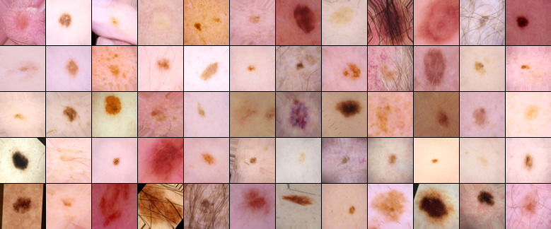
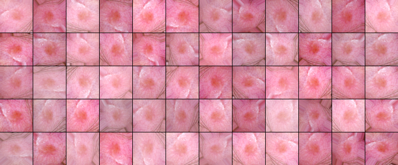

# Melanoma-Detection
Solution for Kaggle's SIIM-ISIC Melanoma Classification that got Rank 57 out of 3314 Participants (Top 2% silver Medal).

[Competition Link](https://www.kaggle.com/c/siim-isic-melanoma-classification/)

[Leaderboard link](https://www.kaggle.com/c/siim-isic-melanoma-classification/leaderboard)

## Dataset
[The training dataset](https://www.kaggle.com/c/siim-isic-melanoma-classification/data) consists of 33,126 lesion images. The test data contains 10982 images. We have also been provided with metadata of patients with corresponding images. The metadata consists of following columns.
* image_name - unique identifier, points to filename of related DICOM or JPEG image
* patient_id - unique patient identifier
* sex - the sex of the patient (when unknown, will be blank)
* age_approx - approximate patient age at time of imaging
* anatom_site_general_challenge - location of imaged site
* diagnosis - detailed diagnosis information (train only)
* benign_malignant - indicator of malignancy of imaged lesion
* target - binarized version of the target variable

Our task is to predict target variable. 0 as target denotes benign and 1 denotes malignant. In addition, we make the use of external dataset. The external dataset consists of malignant data from ISIC 2019 challenge and ISIS 2018 challenge . We also make use of malignant data provided in ISIC website. We deal with a huge imbalance in the training dataset with only 584 samples labelled as 1(malignant) while 32542 samples are labelled as 0. 

## Pre Processing
CNN’s searches for many patterns and features in images. By training models with varying images, we supply CNN’s with multiple features and patterns of different sizes We take ensemble of models trained on different image sizes.

## Data Augmentation
Data Augmentation techniques random rotation and shear augmentation. Augmentation was also provided by random zoom and horizontal and vertical shifting the images. In addition, we also used   random brightness, contrast and saturation. At last random images were centre cropped to provide more augmentation.Some of the Augmented Images are shown below.

  

  <em>Augmentation applied on various images</em>

  

  <em>Illustration of various augmentation applied for training, on a single image.</em>

## Training Details

We use EfficientNets as baseline architecture for our models. All models were trained on Kaggle’s TPUs machine TPU v3-8. We preferred TPU’s over GPU’s as they incorporate bigger batch size which helps gradients converge better. Since we are dealing with an highly imbalanced dataset, small batch sizes may have no positive samples leading to less informative gradients.
We used various combinations of EfficientNet B0 to B5 as baseline architectures for out models. Also, these models were trained on varying sizes. Because of different sizes CNN’s are able to capture different features, hence taking an ensemble of them helps to capture predictions with varying features leading to better results. Also, most of models trained with this approach were trained using external data. The modes were trained with Adam optimizer and used imagenet as pretrained weights [6]. All the models used in this approach used binary cross entropy as loss function with label smoothing factor as 0.05.

For setup run 

`pip install requirements.txt`

For training models parallely on full data run

`python train.py --num_networks 6 --image_size 384 --batch_size 8 --epochs 15`

For training single using K fold validation run with external data 

`python train_fold.py --num_networks 3 --folds 5 --image_size 384 --batch_size 8 --epochs 15 --use_external_data 1`

## Ensemble

Finally ensemble of all models trained with different image sizes were taken using weighted average with weights tuned manually.the dtails of Model scores and ensemble are given in table below
